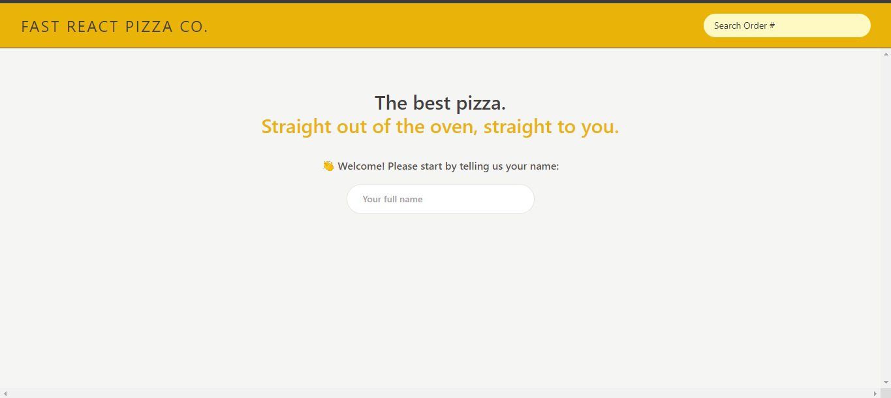
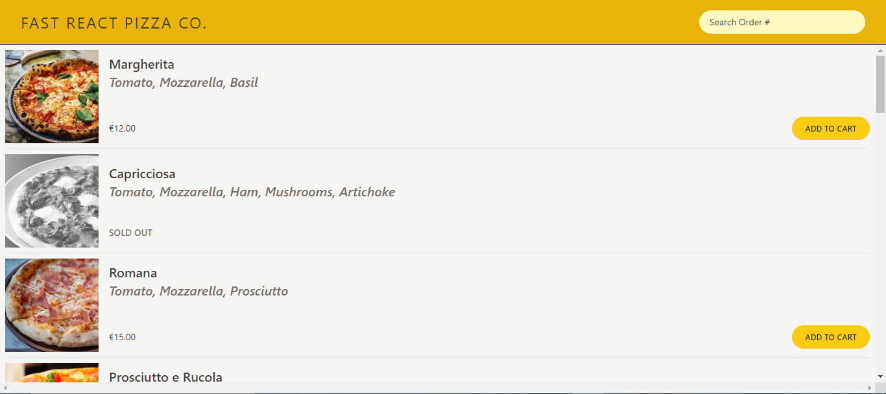
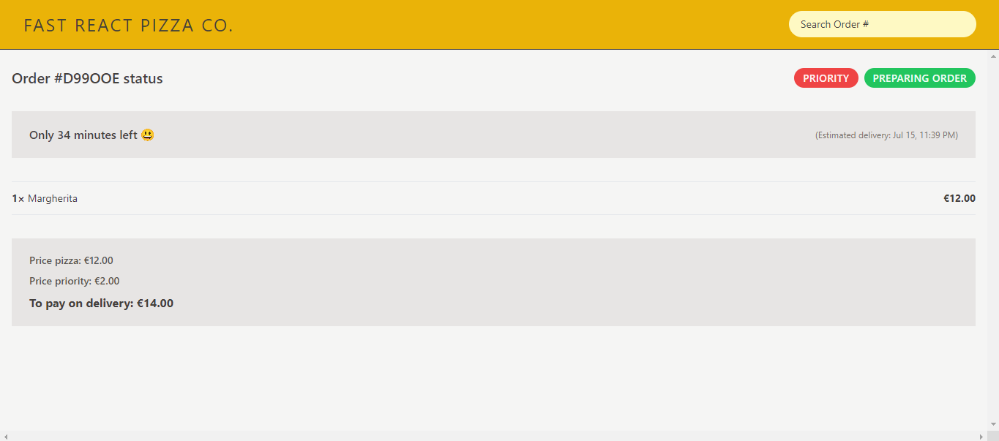

# Fast Pizza Co.

<div id="top"></div>


<!-- PROJECT LOGO -->
<br />
<div align="center">
  <a href="https://fast-react-pizza-tau.vercel.app/">
    
  </a>

  <h3 align="center">Fast Pizza Co.</h3>

  <p align="center">
    <a href="https://fast-react-pizza-tau.vercel.app/">View Demo</a>
    ·
    <a href="https://github.com/MoazElsayedMohamed/fast-pizza-co./issues">Report Bug</a>
  </p>
</div>

<!-- TABLE OF CONTENTS -->
<details>
  <summary>Table of Contents</summary>
  <ol>
    <li>
      <a href="#about-the-project">About The Project</a>
      <ul>
        <li><a href="#features">Features</a></li>
        <li><a href="#built-with">Built With</a></li>
        <li><a href="#flowchart">Flowchart</a></li>
        <li><a href="#architecture">Architecture</a></li>
      </ul>
    </li>
    <li>
      <a href="#getting-started">Getting Started</a>
      <ul>
        <li><a href="#installation">Installation</a></li>
        <li><a href="#tree-structure">Tree Structure</a></li>
      </ul>
    </li>
    <li><a href="#contributing">Contributing</a></li>
    <li><a href="#acknowledgments">Acknowledgments</a></li>
  </ol>
</details>

<!-- ABOUT THE PROJECT -->

## About The Project

Fast Pizza Co. is an ordering web app using put the name and then order pizza with displaying the cost of order.






### Features

| User Stories      | Features                                                                                                                                |
| ----------------- | --------------------------------------------------------------------------------------------------------------------------------------- |
| Order pizzas | <ul><li>functionality: start by put your name and then pizza will be dispalyed |
|  Pay with cart    | <ul><li>By adding pizza to cart and go to cart the cost of order will be displayed</ul>                              |

<p align="right">(<a href="#top">back to top</a>)</p>

---

### Built With

- [HTML](https://html.com/)
- [CSS](https://www.w3schools.com/css/)
- [React](https://www.npmjs.com/package/react)
- Libraries
  - [react-router-dom](https://www.npmjs.com/package/react-router-dom)
  - [react-redux](https://www.npmjs.com/package/react-redux)
  - [@reduxjs/toolkit](https://www.npmjs.com/package/@reduxjs/toolkit)

---

<!-- GETTING STARTED -->

## Getting Started

This project require some prequesites and dependenscies to be installed, you can view it online using this [demo](https://fast-react-pizza-tau.vercel.app/). or you can find the instructions below

> To get a local copy, follow these simple steps :

### Installation

1. Clone the repo
   ```sh
   git clone https://github.com/MoazElsayedMohamed/fast-pizza-co.
   ```
2. Go to project folder

```bash
cd fast-pizza-react
```

3. install dependencies

```bash
npm install
```

4. Run start script

```bash
npm start
```


<!-- CONTRIBUTING -->

## Contributing

Contributions are what make the open source community such an amazing place to learn, inspire, and create. Any contributions you make are **greatly appreciated**.

If you have a suggestion that would make this better, please fork the repo and create a pull request. You can also simply open an issue with the tag "enhancement".
Don't forget to give the project a star! Thanks again!

1. Fork the Project
2. Create your Feature Branch (`git checkout -b feature/AmazingFeature`)
3. Commit your Changes (`git commit -m 'Add some AmazingFeature'`)
4. Push to the Branch (`git push origin feature/AmazingFeature`)
5. Open a Pull Request

<p align="right">(<a href="#top">back to top</a>)</p>

<!-- ACKNOWLEDGMENTS -->

## Acknowledgments

- [Jonas schmedtmann](https://github.com/jonasschmedtmann)
